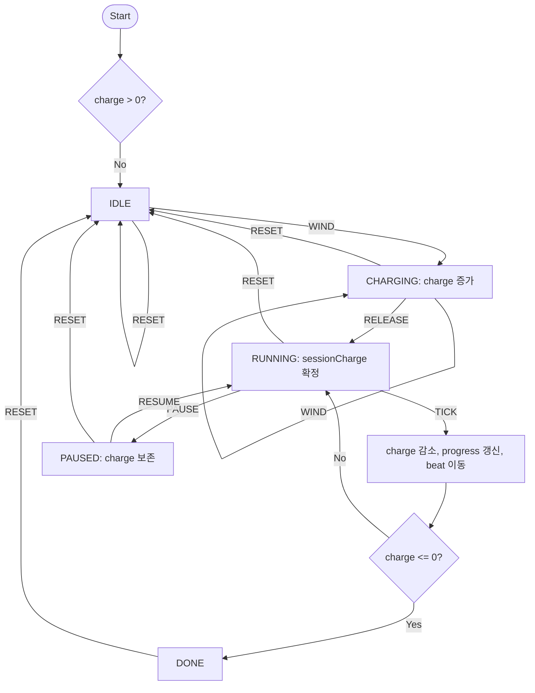

# Engineering · 2주차 과제 — 모래시계 + 오르골 CT

> 대상 사물: **모래시계**, **태엽 오르골**  
> 진행 방식: 분해 → 패턴 인식 → 추상화 → 플로우차트 → React 프로토타입  
> 프로토타입 방향: 두 사물을 그대로 구현하지 않고, 공통 추상화에서 파생한 **Wound Routine Player** 구현

---

## 1. 분해안 (Decomposition)

분해는 사물별로 따로 진행한다. 겉모습보다 **입력 → 저장 → 조절/처리 → 출력 → 종료** 시퀀스가 드러나도록 정리했고, 저수준 요소는 수치 또는 참/거짓으로 표현했다.

### 1-1. 모래시계

```
[고수준 · 목적]
모래시계: 중력으로 고정량의 모래를 일정 속도로 흘려 보내며, 남은 모래량으로 시간을 시각적으로 측정하는 장치

├─ [중수준 1] 입력 — 뒤집기로 측정을 초기화하고 시작한다
│  ├─ flipEvent      : 발생(1) / 없음(0)
│  ├─ isFlipped      : True / False
│  └─ flipTimestamp  : 시작 시각(초)
│
├─ [중수준 2] 저장 — 상부 챔버에 낙하 가능한 모래를 보유한다
│  ├─ totalSand      : 100% (상수)
│  ├─ topSand        : 0~100% (독립 상태변수)
│  └─ bottomSand     : 100 - topSand (파생값)
│
├─ [중수준 3] 처리 — 좁은 목이 모래 흐름을 제한한다
│  ├─ flowRate       : 초당 소모되는 모래 비율
│  ├─ tick           : dt초마다 1회 갱신
│  ├─ remaining      : topSand / flowRate
│  └─ progress       : 1 - topSand / totalSand
│
├─ [중수준 4] 출력 — 모래 높이와 흐름으로 진행도를 보여준다
│  ├─ topHeight      : 0~H
│  ├─ bottomHeight   : 0~H
│  ├─ streamVisible  : True / False
│  └─ isDone         : topSand == 0
│
└─ [중수준 5] 종료 — 상부 모래가 0이 되면 정지한다
   ├─ isIdle         : True / False
   └─ canRestart     : 뒤집기 가능 여부 True / False
```

**조작 → 데이터 변화**

| 조작 | 변하는 데이터 | 변화 규칙 | 트리거 |
|---|---|---|---|
| 뒤집기 | `topSand`, `bottomSand`, `isFlipped` | `topSand ← 100`, `bottomSand ← 0`, `isFlipped ← !isFlipped` | 외부 입력 |
| 시간 경과 | `topSand`, `bottomSand`, `progress`, `isDone` | `topSand ← max(0, topSand - flowRate * dt)`, `bottomSand ← 100 - topSand` | 내부 반복 |

### 1-2. 태엽 오르골

```
[고수준 · 목적]
태엽 오르골: 태엽에 저장한 탄성 에너지를 조절된 회전 운동으로 바꾸고, 핀 실린더가 금속 빗을 튕겨 정해진 멜로디를 자동 재생하는 장치

├─ [중수준 1] 입력 — 손잡이를 감아 에너지를 저장하고 재생을 시작한다
│  ├─ windEvent        : 발생(1) / 없음(0)
│  ├─ windTurns        : 감은 회전 수 0~N
│  ├─ releaseEvent     : 발생(1) / 없음(0)
│  └─ isReleased       : True / False
│
├─ [중수준 2] 저장 — 태엽이 장력으로 에너지를 보유한다
│  ├─ maxTension       : 100% (상수)
│  ├─ springTension    : 0~100% (독립 상태변수)
│  └─ overWound        : springTension > maxTension
│
├─ [중수준 3] 조절/전달 — 기어와 조속기가 방출 속도를 제한한다
│  ├─ gearRatio        : 입력 회전 대비 실린더 회전 비율
│  ├─ governorRPM      : 목표 회전 속도
│  ├─ cylinderAngle    : 0~360도
│  └─ tick             : dt초마다 장력 감소 및 각도 증가
│
├─ [중수준 4] 출력 — 핀과 금속 빗이 소리를 만든다
│  ├─ activePin        : 현재 핀 접촉 True / False
│  ├─ tineIndex        : 울리는 금속 빗 번호 1~M
│  ├─ noteOn           : 발생(1) / 없음(0)
│  ├─ melodyPosition   : 0~melodyLength
│  └─ volume           : 0~100% (장력에 따른 출력 세기)
│
└─ [중수준 5] 종료 — 장력이 임계값 아래로 내려가면 재생이 멈춘다
   ├─ stopThreshold    : 재생 가능 최소 장력
   ├─ isPlaying        : True / False
   └─ isDone           : springTension <= stopThreshold
```

**조작 → 데이터 변화**

| 조작 | 변하는 데이터 | 변화 규칙 | 트리거 |
|---|---|---|---|
| 태엽 감기 | `springTension`, `windTurns` | `springTension ← min(maxTension, springTension + tensionPerTurn * turns)` | 외부 입력 |
| 재생 시작 | `isReleased`, `isPlaying` | `springTension > stopThreshold`이면 `isReleased ← True`, `isPlaying ← True` | 외부 입력 |
| 시간 경과 | `springTension`, `cylinderAngle`, `melodyPosition`, `noteOn` | `springTension ← max(0, springTension - releaseRate * dt)`, `cylinderAngle += governorRPM * dt`, 핀 위치와 각도가 맞으면 `noteOn` | 내부 반복 |
| 자동 정지 | `isPlaying`, `isDone` | `springTension <= stopThreshold`이면 `isPlaying ← False`, `isDone ← True` | 내부 조건 |

---

## 2. 패턴 인식 (Pattern Recognition)

### 2-1. 비교 매트릭스

| 비교 기준 | 모래시계 | 태엽 오르골 |
|---|---|---|
| 동력원 | 중력 위치에너지 | 태엽의 탄성 에너지 |
| 입력 방식 | 뒤집기 1회 | 손잡이 감기 + 재생 해제 |
| 저장 매체 | 상부 챔버의 모래량 | 태엽 장력 |
| 조절 장치 | 좁은 목이 유량 제한 | 기어/조속기가 회전 속도 제한 |
| 반복 루프 | `tick`마다 모래 감소 | `tick`마다 장력 감소 + 실린더 회전 |
| 출력 피드백 | 모래 높이, 흐름, 진행률 | 멜로디, 음량, 실린더 위치 |
| 종료 조건 | `topSand == 0` | `springTension <= stopThreshold` |
| 제어 가능성 | 시작 후 중간 제어 거의 없음 | 감은 양에 따라 재생 길이 변화, 재생 중 정지는 구조에 따라 제한 |
| 오차/제약 | 습도, 입자 크기, 목 지름 | 태엽 장력, 마찰, 조속기 안정성 |

### 2-2. 공통 패턴

- 외부 입력이 **유한 자원**을 준비한다.
- 준비된 자원은 내부 조절 장치를 거쳐 **시간에 따라 단조 감소**한다.
- 사용자는 내부 수치를 직접 보지 않고, **출력의 변화**로 진행도를 읽는다.
- `tick → 자원 감소 → 파생값 갱신 → 출력 변화 → 종료 조건 검사` 루프를 가진다.
- 종료는 사용자가 누르는 버튼보다 **자원 소진 조건**에 의해 자동 발생한다.

### 2-3. 차이 패턴

- 모래시계 출력은 시각 중심이고, 오르골 출력은 청각 중심이다.
- 모래시계는 뒤집는 순간 거의 항상 최대치로 재충전되지만, 오르골은 감은 회전 수에 따라 충전량이 달라진다.
- 모래시계의 조절 장치는 유량을 제한하고, 오르골의 조절 장치는 회전 속도를 제한한다.
- 모래시계는 진행 상태가 물질 위치로 직접 드러나지만, 오르골은 내부 장력보다 멜로디 진행과 음량으로 간접 표시된다.

**핵심 작동 규칙**

> 물리적 입력으로 유한 자원을 충전하면, 내부 조절 장치가 그 자원을 일정한 속도로 방출하고, 방출 과정이 감각적 출력으로 변환되며, 자원이 소진되면 자동 종료된다.

---

## 3. 추상화 (Abstraction)

### 3-1. 한 줄 모델

> **유한 자원을 외부 입력으로 충전하고, 조절된 속도로 방출하면서, 잔여 자원과 진행도를 감각적 출력 패턴으로 표현하는 시스템.**

### 3-2. 추상화 요소

**상수**

- `CAPACITY`: 저장 가능한 최대 자원량
- `RELEASE_RATE`: 단위 시간당 자원 방출량
- `OUTPUT_PATTERN`: 진행 중 출력되는 패턴 집합
- `DONE_THRESHOLD`: 종료 판정 기준값

**변수**

- `charge`: 현재 저장 자원량, `0..CAPACITY`
- `sessionCharge`: 방출을 시작할 때 확정된 자원량
- `progress`: `(sessionCharge - charge) / sessionCharge`
- `remaining`: `charge / RELEASE_RATE`
- `patternIndex`: 현재 출력 패턴 위치

**상태**

- `IDLE`: 자원이 없고 대기
- `CHARGING`: 외부 입력으로 자원을 충전 중
- `READY`: 방출 시작 가능
- `RUNNING`: 자원 방출 중
- `PAUSED`: 디지털 인터페이스에서만 허용하는 보존 상태
- `DONE`: 자원 소진으로 완료

**트리거**

- `WIND`: 자원 충전
- `RELEASE`: 충전량 확정 후 방출 시작
- `TICK`: 시간 경과에 따른 자원 감소
- `PAUSE`: 방출 정지
- `RESUME`: 방출 재개
- `RESET`: 초기화
- `AUTO_DONE`: `charge <= DONE_THRESHOLD`

### 3-3. 명칭 매핑

| 추상 명칭 | 모래시계 | 태엽 오르골 | 프로토타입 |
|---|---|---|---|
| `charge` | 상부 모래량 | 태엽 장력 | 감아 둔 루틴 자원 |
| `CAPACITY` | 전체 모래량 | 최대 장력 | 최대 충전 시간 |
| `RELEASE_RATE` | 모래 낙하 속도 | 태엽 방출 속도 | 초당 소모량 |
| `OUTPUT_PATTERN` | 모래 높이 변화 | 멜로디 음표 | 루틴 비트 점등 |
| `DONE_THRESHOLD` | `topSand == 0` | 최소 장력 이하 | `charge == 0` |
| `WIND/RELEASE` | 뒤집기 | 태엽 감기/해제 | 감기/방출 버튼 |

### 3-4. 스코프 점검

| 대상 | 충전 가능한 유한 자원 | 조절된 시간 방출 | 출력 패턴 | 판정 |
|---|:--:|:--:|:--:|---|
| 모래시계 | O | O | O | 포함 |
| 태엽 오르골 | O | O | O | 포함 |
| 주방 타이머 | O | O | O | 포함 가능 |
| 메트로놈 | △ | O | O | 제외에 가까움: 충전 자원보다 반복 기준 장치 |
| 줄자 | X | X | X | 제외 |
| 달력 | X | △ | X | 제외 |

---

## 4. 플로우차트 (Flowchart)

### 4-1. 인터페이스 개요

> **사용자가 태엽을 감듯 루틴 자원을 충전하면, 충전량만큼 루틴 비트가 시간에 따라 재생되고, 자원이 소진되면 자동으로 끝나는 디지털 루틴 플레이어.**

### 4-2. 상태 전이 시나리오

- `[IDLE]`에서 `WIND`가 들어오면 `charge`가 증가하고 `[CHARGING]`으로 이동한다.
- `[CHARGING]`에서 `RELEASE`가 들어오면 `sessionCharge`를 확정하고 `[RUNNING]`으로 이동한다.
- `[RUNNING]`에서 `TICK`이 들어오면 `charge`가 감소하고 `progress`, `remaining`, `patternIndex`가 갱신된다.
- `[RUNNING]`에서 `PAUSE`가 들어오면 `charge`를 보존하고 `[PAUSED]`로 이동한다.
- `[PAUSED]`에서 `RESUME`이 들어오면 `[RUNNING]`으로 돌아간다.
- `[RUNNING]`에서 `charge == 0`이면 내부 자동 전이로 `[DONE]`이 된다.
- 어느 상태에서든 `RESET`이 들어오면 `charge = 0`이 되고 `[IDLE]`로 이동한다.

### 4-3. Mermaid 플로우차트



### 4-4. 상태 전이표

| 상태 ＼ 입력 | WIND | RELEASE | TICK | PAUSE | RESUME | RESET |
|---|---|---|---|---|---|---|
| `IDLE` | `CHARGING`, `charge↑` | no-op | N/A | no-op | no-op | `IDLE` |
| `CHARGING` | `CHARGING`, `charge↑` | `RUNNING` | N/A | no-op | no-op | `IDLE` |
| `RUNNING` | no-op | no-op | `charge↓`, 0이면 `DONE` | `PAUSED` | no-op | `IDLE` |
| `PAUSED` | no-op | no-op | no-op | no-op | `RUNNING` | `IDLE` |
| `DONE` | `CHARGING`, 새 충전 | no-op | N/A | no-op | no-op | `IDLE` |

---

## 5. 프로토타입 (Prototype)

### 5-1. 결과물

- React/Vite 프로토타입: `2주차/prototype/`
- 실행 파일 진입점: `2주차/prototype/src/App.tsx`
- 상태 머신: `2주차/prototype/src/stateMachine.ts`
- 테스트: `2주차/prototype/src/stateMachine.test.ts`, `2주차/prototype/src/App.test.tsx`

### 5-2. 구현 아이디어

**Wound Routine Player**는 모래시계나 오르골을 화면에 그대로 옮긴 것이 아니다. 두 사물의 공통 구조인 **충전 → 조절된 방출 → 출력 패턴 → 자동 종료**를 가져와, 루틴을 감아서 재생하는 디지털 인터페이스로 변환했다.

### 5-3. 주요 조작

- `감기`: `charge`를 증가시킨다.
- `방출`: 현재 `charge`를 `sessionCharge`로 확정하고 작동을 시작한다.
- `일시정지`: 방출을 멈추고 `charge`를 보존한다.
- `재개`: 보존된 `charge`에서 다시 방출한다.
- `초기화`: 모든 값을 초기화하고 대기로 돌아간다.

### 5-4. 검증 기준

- `WIND`, `RELEASE`, `TICK`, `PAUSE`, `RESUME`, `RESET` 상태 전이가 테스트로 검증된다.
- UI 버튼이 상태 머신 이벤트와 연결된다.
- 빌드가 성공하면 제출 가능한 정적 앱 산출물이 `dist/`에 생성된다.

